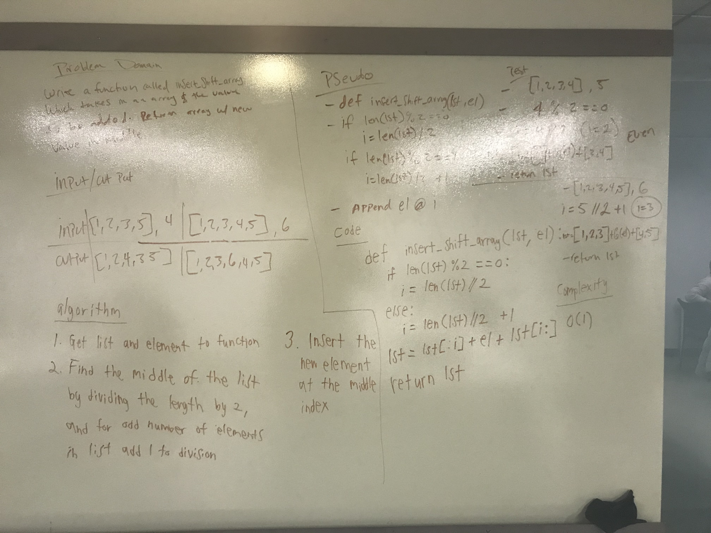

# Insert into an Array
<!-- Short summary or background information -->

## Challenge
Write a function called insert_shift_array which takes in an array and the value to be added. Without utilizing any of the built-in methods available to your language, return an array with the new value added at the middle index.

## Approach & Efficiency
<!-- What approach did you take? Why? What is the Big O space/time for this approach? -->
We kinda just broke the problem down to the bare min and asked ourselves what we needed to do.

Time complexity is O(1)

## Solution
<!-- Embedded whiteboard image -->
%